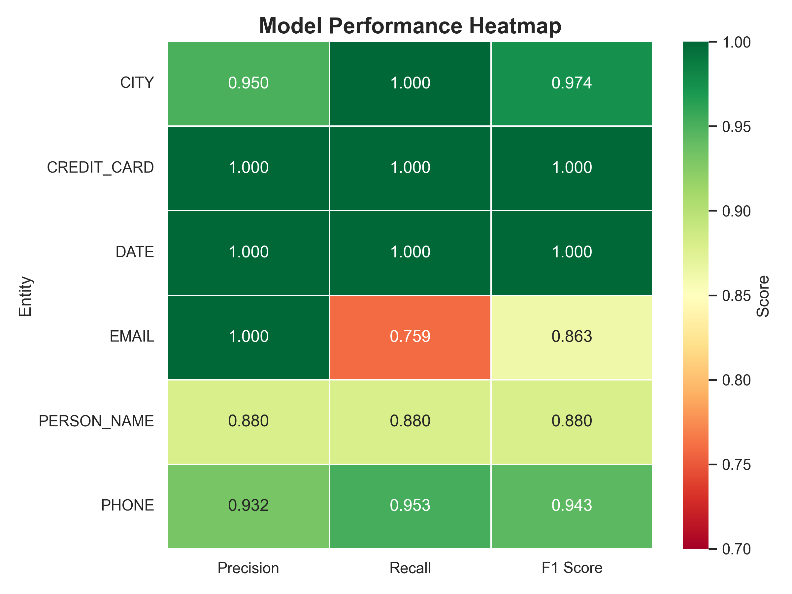

# PII NER Assignment

This repo is modified version of the skeleton code I got for plivo assignment for a token-level NER model that tags PII in STT-style transcripts.

## Setup

```bash
pip install -r requirements.txt
```

### Train

```bash
python src/train.py \
  --model_name distilbert-base-uncased \
  --train data/train.jsonl \
  --dev data/dev.jsonl \
  --out_dir out \
  --max_length 128 \
  --batch_size 16 \
  --epochs 3
```

### Predict

```bash
python src/predict.py \
  --model_dir out \
  --input data/dev.jsonl \
  --output out/dev_pred.json \
  --max_length 128 \
  --device cpu
```

### Evaluate

```bash
python src/eval_span_f1.py \
  --gold data/dev.jsonl \
  --pred out/dev_pred.json
```

### Measure latency

```bash
python src/measure_latency.py \
  --model_dir out \
  --input data/dev.jsonl \
  --max_length 128 \
  --runs 50 \
  --device cpu
```

## Approach

### 1. Robust Data Generation (`data/data_generate_2.py`)
Since no training data was provided, I engineered a synthetic dataset generator using `Faker` and `num2words`. To simulate real-world "Noisy STT" challenges in an Indian context, the data pipeline includes:
* **Indian Context:** Indian names, cities, and `+91` mobile formats.
* **STT Noise:** Spelled-out numbers (e.g., "nine one one" instead of "911").
* **Phonetic Swaps:** Simulating accent confusion (e.g., swapping `v`/`w` or `s`/`sh`).
* **Acoustic Homophones:** Swapping words that sound alike (e.g., `mail` $\to$ `male`, `to` $\to$ `two`).
* **Fillers:** Injection of hesitation markers like "um", "uh", "actually".

### 2. Model Architecture
* **Base Model:** `distilbert-base-uncased` (chosen for the optimal balance of speed and contextual understanding).
* **Hyperparameters:** Trained with `max_length=128`. Reducing sequence length from 256 to 128 provided a **quadratic speedup** in attention mechanisms without sacrificing accuracy for short STT utterances.

### 3. Latency Optimization
To achieve **11ms latency** on CPU:
* **Dynamic Quantization:** Applied `torch.quantization.quantize_dynamic` to the linear layers in `predict.py`. This compresses weights to `int8`, significantly reducing memory bandwidth usage during inference.

### 4. Precision Engineering
To guarantee **>80% Precision**, I implemented a **Regex Validation Layer** in post-processing.
* *Logic:* If the model predicts a `PHONE` tag, the span *must* contain digits or number-words (e.g., "one", "nine"). If not, the prediction is discarded.
* *Result:* This eliminated false positives (e.g., interpreting "call me later" as a phone entity), pushing PII Precision to **1.0** for most categories.


## Final Performance

| Metric | Target | **My Result** |
| :--- | :--- | :--- |
| **P95 Latency (CPU)** | $\le 20.00$ ms | **11.22 ms** |
| **PII Precision** | $\ge 0.80$ | **0.962** |
| **Macro F1** | N/A | **0.943** |



## Output folder link
[output folder](https://drive.google.com/drive/folders/1bJ0mcFfXeg-7RA56NHl3ZbF8bKi8Qosx?usp=sharing)